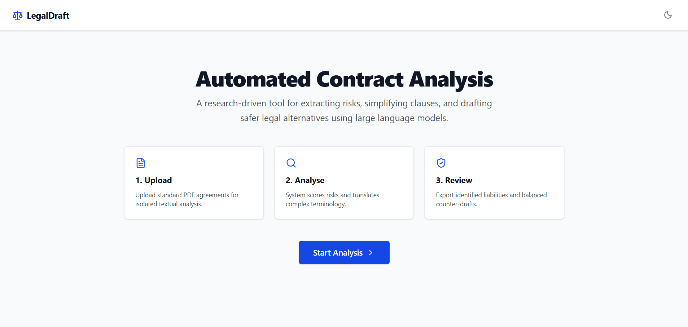
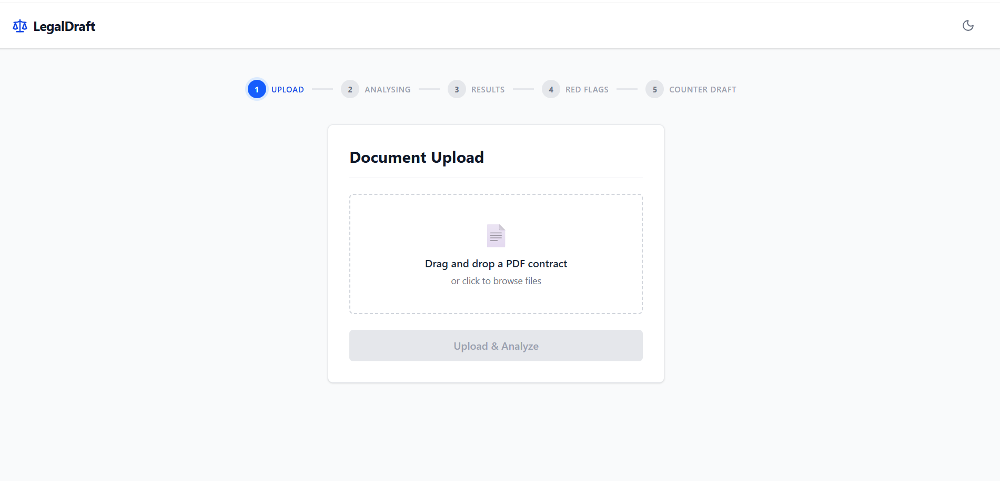
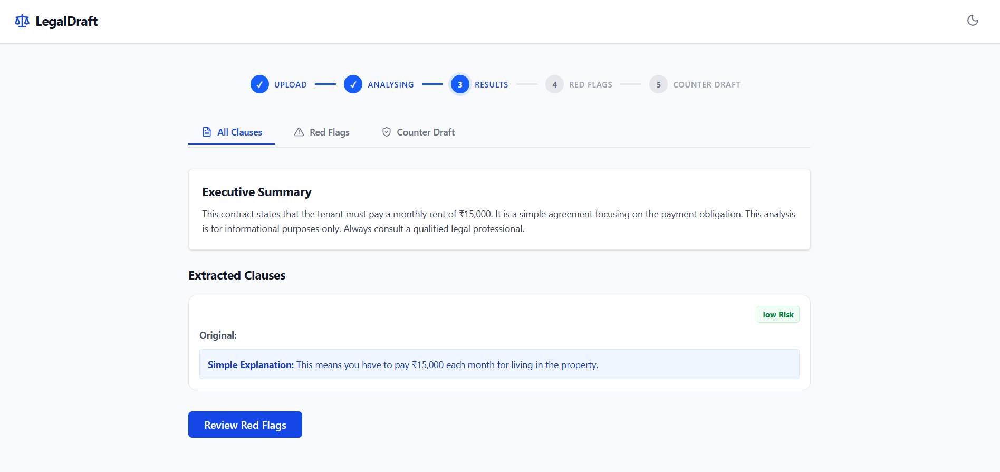

# LegalDraft AI

AI-powered legal contract analysis for ordinary people in India.

## Problem
Legal contracts can be difficult for ordinary people to understand because they often contain complex legal language. LegalDraft AI helps users understand important contract clauses, identify potential risks, and get a simple summary in plain English.

## Live URL
https://legaldraft-ai-alpha.vercel.app/

## Screenshots
###Home Page

###Contract Analysis
 
 
### Results
 
 
## Tech Stack

- Frontend: React + Vite + Tailwind CSS
- Backend: Node.js + Express
- Database: MongoDB (Atlas)
- AI: OpenAI API (GPT-4o-mini)
- PDF: pdf-parse + Multer
- Hosting: Vercel (Frontend) + Render (Backend)

## Features

- Upload legal contracts in PDF format
- Extract text from uploaded PDFs
- AI-powered contract analysis
- Simple and easy-to-understand contract summary
- Clause-wise analysis
- Risk identification
- Red flag detection
- Counter-draft suggestions
- Categorization of important clauses
- Friendly interface for ordinary users

## How to Run Locally
###Clone the Repository

''bash
git clone https://github.com/wadhwanirahulravi-ctrl/legaldraft-ai.git

###Backend

cd backend

npm install

npm start

###Frontend

cd frontend

npm install

npm run dev

##Team Members

•	Rahul – Frontend development and UI 

•	Rehyan – Backend routes and MongoDB integration 

•	Gauri – AI service and prompt integration

•	Shweta Ghogare – Contract and Analysis models, PDF upload and text extraction 

